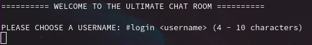
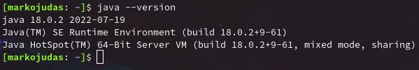
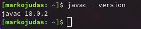
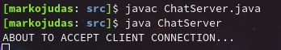
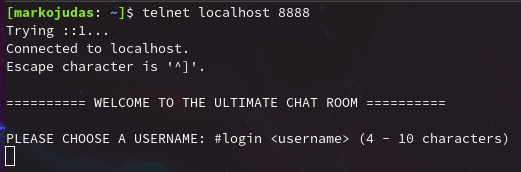
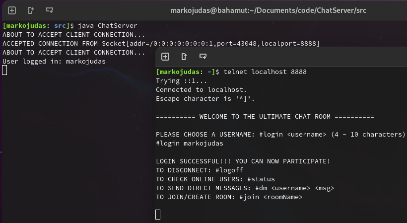
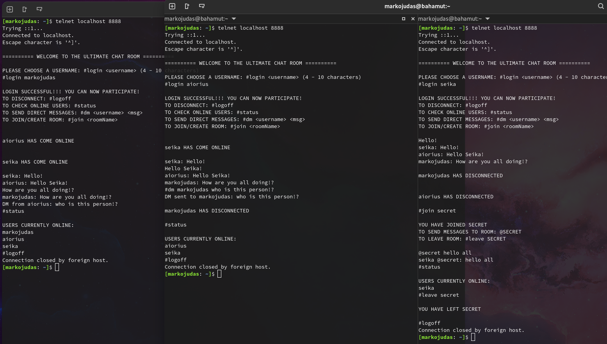

<!-- markdownlint-disable -->

# CHAT SERVER

<h3>A very simple Java application that runs on any terminal.</h3>
<br>
<p align="center"></p>
<br>

## REQUIREMENTS

<ul>
    <li><a ref="https://www.oracle.com/java/technologies/downloads/">Java Development Kit</a></li>
</ul>

<p>To check if you have required tools run the following commands on your terminal:</p>



<br>

## INSTALL

<pre><code>git clone https://github.com/Markojudas/java-terminal-chatroom.git</code></pre>
<br>

## RUN

<pre><code>cd java-terminal-chatroom/src
javac ChatServer.java
java ChatServer</code></pre>

<br>
<br>

## CONNECT

<p>On a different terminal you can use <strong>telnet</strong>
 to connect to the server as it is listening for connections:</p>

```bash
telnet localhost 8888
```


<p>Note: I'd recommend running this application on a virtual machine or in a cloud instance (AWS/GCP/Linode) with a public IP, as long as you open port <code>8888</code>.</p>
<p> If so, run you can connect using your <code>public IP</code> instead of <code>localhost</code>.</p>
<h5>Disclaimer: This application did not implement any kind of security measures. use at own risk</h5>
<br>

## USAGE


<br>

<p>Here is a little example - Yes, I am playing the role of all 3 users</p>

